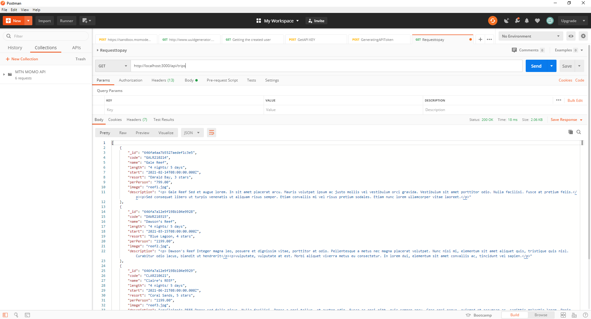

# README

## Project Overview

This README provides an overview of the full stack web application developed for Travlr Getaways, a travel booking website. It includes information about the architecture, functionality, testing, and a reflection on the overall process.

### Architecture

In this project, we utilized multiple frontend development technologies. Express HTML was used for server-side rendering, this allowed for quit prototyping and testing. JavaScript and more specifically Typescript (TypeScript extends JavaScript and improves the developer experience and reduce runtime errors, the ability to add types in TypeScript is also a big advantage over vanilla JavaScript) was used extensively on both the frontend and backend to add interactivity and implement business logic. Additionally, we incorporated a single-page application (SPA) approach, where the initial HTML page is loaded, and subsequent interactions are handled by JavaScript to update the UI dynamically without reloading the entire page. This approach provides a smooth user experience and reduces server load.

The backend of the application employed a NoSQL MongoDB database for several reasons. NoSQL databases are highly flexible and scalable, allowing us to handle complex data structures and adapt to changing requirements easily. Unlike SQL databases that requires a schema to be conformed to, NoSQL databases allow for the developer to define the data they want to save at any time. MongoDB's document-oriented model fits well with the nature of our data, providing a more natural representation and allowing for seamless integration with JavaScript-based backend frameworks like Node.js.

### Functionality

JSON (JavaScript Object Notation) is a lightweight data interchange format that is derived from JavaScript. It provides a standardized way to represent structured data, making it easy to transmit and parse between different systems. In our full stack development, JSON played a crucial role in tying together the frontend and backend components. We used JSON to serialize data on the backend, allowing us to send structured data to the frontend. The frontend then parsed the JSON data and used it to dynamically update the UI. User input is also encoded as JSON and sent to database which converts it to MongoDB collections, and documents.

Throughout the development process, we refactored code to improve functionality and efficiency. One notable approach was the creation of reusable UI components. By encapsulating common UI elements and functionalities into reusable components, we achieved code modularity and reusability. This resulted in reduced duplication, improved maintainability, and accelerated development. For example, we created a reusable "Navbar" component that could be easily integrated into multiple pages, saving time and effort.

### Testing

Testing in a full stack application involves various methods and endpoints. Methods refer to the HTTP verbs used in API requests, such as GET, POST, PUT, DELETE, etc. Endpoints are specific URLs that the backend exposes to handle these requests. In our application, we conducted API testing to ensure the correct functioning of these endpoints. This involved sending requests to the endpoints with different parameters and verifying that the expected responses were received. Postman was specifically useful in this regard as it provided us a nice interface to interact with and test data from the backend and database.

Additionally, we faced the challenge of testing with added layers of security. This included testing authentication and authorization mechanisms. Security testing was also performed to identify and address potential vulnerabilities, ensuring that the application's sensitive data and user interactions remained secure and not accessible to unauthorized users.

### Reflection

This course has been immensely beneficial in helping me reach my professional goals. Throughout the course, I have learned, developed, and mastered a range of skills that have made me a more marketable candidate in my career field. Some of the key skills include:

Full stack development: I gained a comprehensive understanding of both frontend and backend development, enabling me to build end-to-end web applications. This has made me versatile and capable of handling various aspects of the development process.

Proficiency in JavaScript and TypeScript: JavaScript is a fundamental language for web development, and this course has helped me become proficient in it. I can now leverage JavaScript's power to implement dynamic and interactive features in web applications. I also fell in love with TypeScript throughout the course. I love the fact that it added classes to JavaScript which solves most of the runtime errors that developers run into and provides null safety.

API development: I learned how to design and implement APIs, allowing different systems to communicate and exchange data. This knowledge has been essential in building robust and scalable applications that can integrate with other services.

Security considerations: The course emphasized the importance of security in web applications. I gained a solid understanding of common security vulnerabilities, best practices for secure coding, and techniques to protect against threats, and general authentication and permission in applications. This knowledge has made me more conscious of security aspects and better equipped to develop secure applications.

Overall, this course has provided me with a strong foundation in full stack web development and equipped me with the skills necessary to excel in my career. I am confident in my ability to contribute to real-world projects and meet the demands of the industry.

## Screenshots

